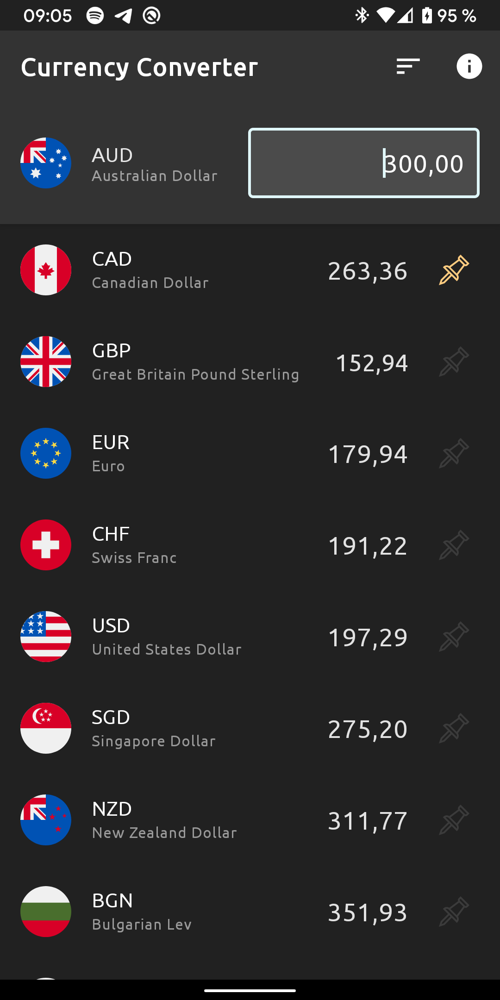

# Currency Converter

<table>
  <tr>
    <td>
      
    </td>
    <td>
      
    </td>
    <td>
      
    </td>
  </tr>
</table>

### Description
Currency Converter is a simple application to play with lists by using currency conversion. 

The app is getting the rate list from the [Exchange Rates API](https://github.com/exchangeratesapi/exchangeratesapi) which itself gets its data from the European Central Bank.

### Stack
The app is using Kotlin, RxJava2, Dagger2, MVVM, Retrofit2, Mockito2 and Robolectric

