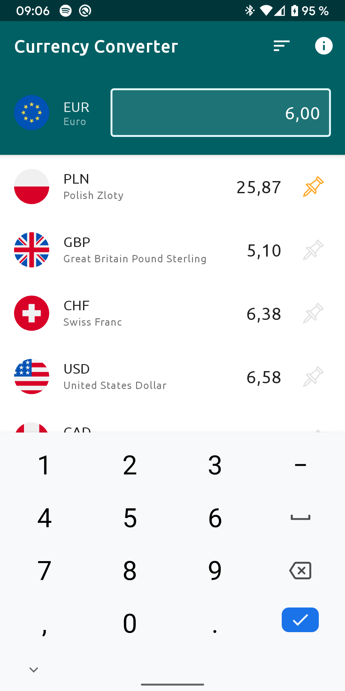

# Currency Converter

<table>
  <tr>
    <td>
      
    </td>
    <td>
      
    </td>
    <td>
      
    </td>
  </tr>
 </table>

### Description

Currency Converter is a playground to explore lists (display and sorting) by using currency conversion. It gets the rate list from the [Exchange Rates API](https://github.com/exchangeratesapi/exchangeratesapi) which itself gets its data from the European Central Bank. 

It uses Kotlin, RxJava, Dagger, MVVM, Room, Retrofit, Mockito and Robolectric, and Material Components (including a dark mode version). It supports tablets and landscape mode.

The release of the Alpha version of this app is waiting for Google's approval.

### Release

##### Version 1.0-Beta

- display and persistence of the rate list from the ECB
- sorting options by name or rate value
- instant conversion when a value is entered by the user
- translated from English to German and French
- [Available as Beta release on the Play Store](https://play.google.com/store/apps/details?id=com.meewii.rateconverter)

##### Version 1.1

- option to pin one currency to have it always at the top
- fixed some bugs

##### Version 1.2

- rework of the ExchangeRateRepository, now the list of Rates is always fetched from API first, then fallback to DB if unavailable.